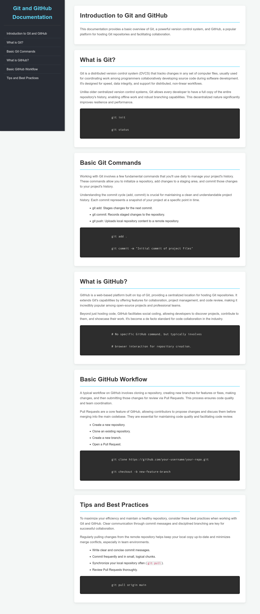

# 📚 Technical Documentation Page: Introduction to Git and GitHub

-----

## 🇧🇷 Português

### 🎯 Objetivo do Projeto

Este projeto consiste em uma **Página de Documentação Técnica**, desenvolvida como parte dos desafios do curso **"Responsive Web Design" do freeCodeCamp**. O objetivo principal foi criar uma página com uma estrutura de documentação navegável e responsiva, focando na apresentação clara de um conteúdo técnico (neste caso, uma introdução a Git e GitHub) e na usabilidade em diversos dispositivos.

### 🖼️ Visão Geral do Projeto



### ✨ Funcionalidades

A Página de Documentação Técnica sobre Git e GitHub inclui as seguintes seções e elementos:

  * **Barra de Navegação Lateral (Navbar):** Permite a navegação fácil entre as diferentes seções do documento.
      * `header`: Título principal da documentação.
      * `nav-link`: Links que levam a cada seção do conteúdo principal.
  * **Conteúdo Principal (Main Document):** Contém as seções detalhadas sobre Git e GitHub.
      * **"Introduction to Git and GitHub"**: Visão geral do que é abordado.
      * **"What is Git?"**: Explicação detalhada sobre o sistema de controle de versão.
      * **"Basic Git Commands"**: Comandos essenciais para o uso diário do Git, com exemplos de código.
      * **"What is GitHub?"**: Descrição da plataforma e seu propósito.
      * **"Basic GitHub Workflow"**: Explicação sobre o fluxo de trabalho colaborativo no GitHub, incluindo Pull Requests.
      * **"Tips and Best Practices"**: Dicas para um uso eficiente e boas práticas de colaboração.
  * **Blocos de Código (`<code>`):** Exemplos práticos de comandos Git e trechos de código para ilustrar conceitos.
  * **Listas (`<ul>`):** Para apresentar informações de forma organizada e concisa.

### 🚀 Tecnologias Utilizadas

  * **HTML5:** Estrutura semântica e acessível da página, incluindo elementos de navegação e seções de conteúdo.
  * **CSS3:** Estilização completa da página, com foco em:
      * **Layout Responsivo:** Implementação de `Flexbox` para o layout da página principal (barra de navegação e conteúdo) e `Media Queries` para garantir que a página se adapte fluidamente a diferentes tamanhos de tela (desktops, tablets e smartphones).
      * **Tipografia e Cores:** Paleta de cores que visa clareza e legibilidade, com fontes que facilitam a leitura de conteúdo técnico.
      * **Barra de Navegação Fixa:** A barra lateral permanece visível enquanto o usuário rola o conteúdo principal, melhorando a experiência de navegação.

### 🎨 Design

O design da página foi pensado para ser **funcional e limpo**, priorizando a legibilidade do conteúdo técnico. A barra de navegação lateral fixa melhora significativamente a usabilidade, permitindo que o usuário salte rapidamente entre os tópicos. A estética é moderna e neutra, adequada para documentação técnica.

### 🔗 Acesso ao Projeto

Você pode visualizar este projeto diretamente no GitHub Pages (se você configurá-lo) ou clonar o repositório para executá-lo localmente:

```bash
git clone https://github.com/GabrielMassensini/freecodecamp-technical-documentation-page.git
cd freecodecamp-technical-documentation-page
```

Basta abrir o arquivo `index.html` em seu navegador web preferido.

### 🌟 Status do Projeto

Concluído e passando em todos os testes do desafio do freeCodeCamp.

-----

## 🇬🇧 English

### 🎯 Project Objective

This project is a **Technical Documentation Page**, developed as part of the **"Responsive Web Design" course challenges from freeCodeCamp**. The primary goal was to create a navigable and responsive documentation structure, focusing on the clear presentation of technical content (in this case, an introduction to Git and GitHub) and usability across various devices.

### 🖼️ Project Overview


### ✨ Features

The Technical Documentation Page on Git and GitHub includes the following sections and elements:

  * **Side Navigation Bar (Navbar):** Allows for easy navigation between different sections of the document.
      * `header`: Main title of the documentation.
      * `nav-link`: Links that lead to each section of the main content.
  * **Main Content (Main Document):** Contains detailed sections about Git and GitHub.
      * **"Introduction to Git and GitHub"**: Overview of the topics covered.
      * **"What is Git?"**: Detailed explanation of the version control system.
      * **"Basic Git Commands"**: Essential commands for daily Git use, with code examples.
      * **"What is GitHub?"**: Description of the platform and its purpose.
      * **"Basic GitHub Workflow"**: Explanation of the collaborative workflow on GitHub, including Pull Requests.
      * **"Tips and Best Practices"**: Tips for efficient use and best collaboration practices.
  * **Code Blocks (`<code>`):** Practical examples of Git commands and code snippets to illustrate concepts.
  * **Lists (`<ul>`):** To present information in an organized and concise manner.

### 🚀 Technologies Used

  * **HTML5:** Semantic and accessible page structure, including navigation elements and content sections.
  * **CSS3:** Complete page styling, focusing on:
      * **Responsive Layout:** Implementation of `Flexbox` for the main page layout (navbar and content) and `Media Queries` to ensure the page adapts fluidly to different screen sizes (desktops, tablets, and smartphones).
      * **Typography and Colors:** Color palette aiming for clarity and readability, with fonts that facilitate the reading of technical content.
      * **Sticky Navbar:** The sidebar remains visible while the user scrolls through the main content, improving the navigation experience.

### 🎨 Design

The page's design was conceived to be **functional and clean**, prioritizing the readability of technical content. The sticky side navigation bar significantly enhances usability, allowing the user to quickly jump between topics. The aesthetic is modern and neutral, suitable for technical documentation.

### 🔗 Project Access

You can view this project directly on GitHub Pages (if you set it up) or clone the repository to run it locally:

```bash
git clone https://github.com/GabrielMassensini/freecodecamp-technical-documentation-page.git
cd freecodecamp-technical-documentation-page
```

Simply open the `index.html` file in your preferred web browser.

### 🌟 Project Status

Completed and passed all freeCodeCamp challenge tests.

-----

## 👤 Author

**Gabriel Alves Massensini**